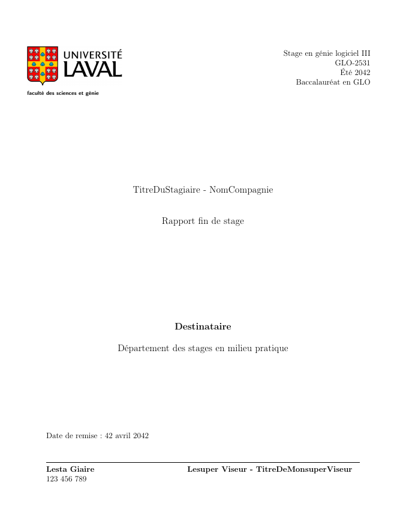
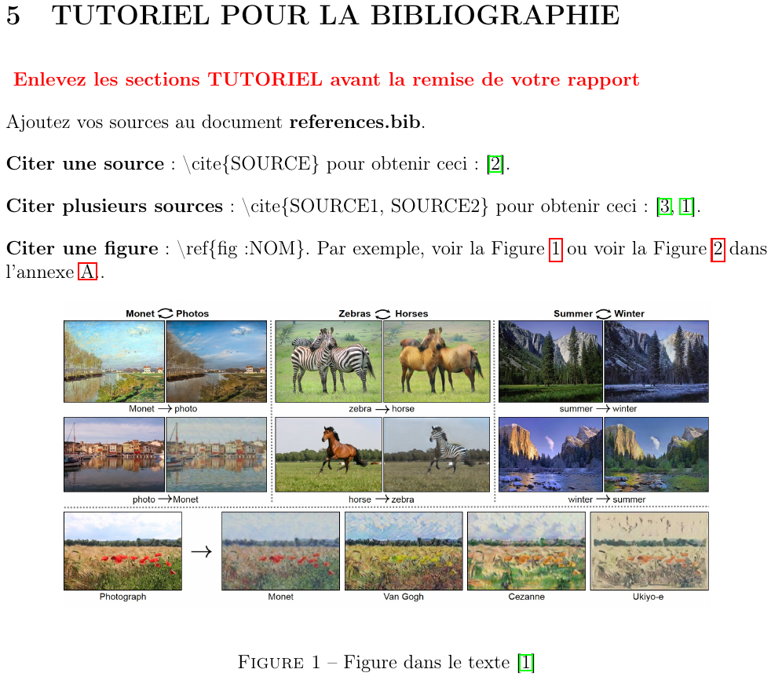
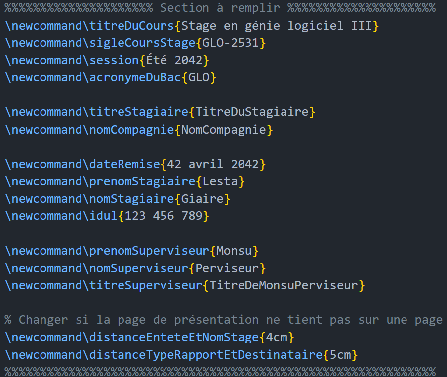
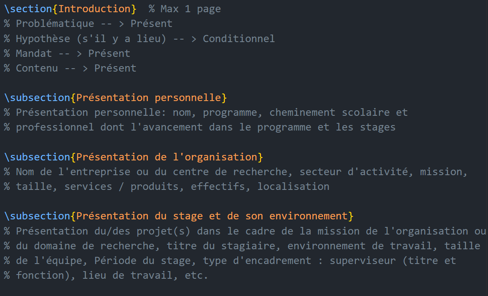

# ULaval : gabarit de rapport de stage

Un gabarit LaTeX pour faire votre rapport de stage en génie de l'Université Laval pendant la session d'été 2021 et 2022 ([télécharger](https://github.com/NathanielDamours/ulaval-gabarit-rapport-stage/archive/refs/heads/main.zip)).

- [ULaval : gabarit de rapport de stage](#ulaval--gabarit-de-rapport-de-stage)
  - [Extrait du pdf produit](#extrait-du-pdf-produit)
  - [Extrait du document LaTeX](#extrait-du-document-latex)

## Extrait du pdf produit

## Extrait du document LaTeX

La page de présentation se remplie automatiquement avec ce que vous entrez ici :

Plusieurs commentaires ont été ajoutés pour guider votre rapport :

